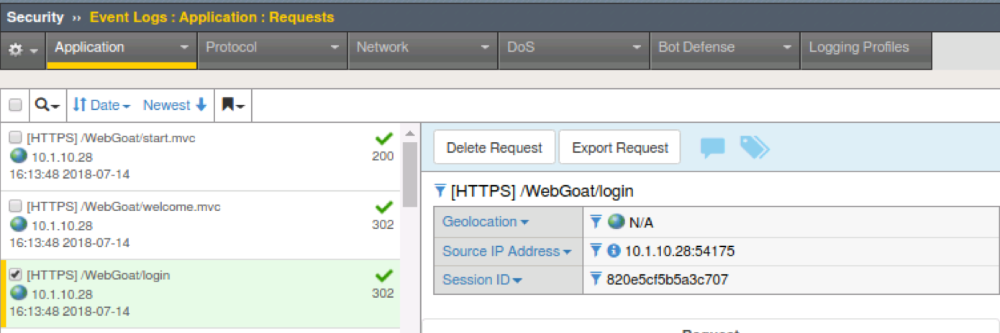

Exercise 2.1: Protocol Compliance
----------------------------------------

Objective
~~~~~~~~~

- Attach the security policy to the appropriate virtual server.

- Validate that the security policy is working correctly.

- Implement HTTP Protocol Compliancy checks

- Explore Learning and Blocking

- Get familiar with ASM Event Logs

- Estimated time for completion **45** **minutes**.

Apply Security Policy
~~~~~~~~~~~~~~~~~~~~~

.. IMPORTANT:: To clearly demonstrate just the protocol compliance protection, on the ``webgoat.f5demo.com_https_vs`` virtual server

1. **Remove** the previously created DoS profile and bot logging profile.
2. **Enable** the ``lab1_webgoat_waf`` Security Policy

Your virtual should look like this

.. image:: images/image1.PNG

Burp'ing the App
~~~~~~~~~~~~~~~~

In this section we are going to use the free/community version of an excellent DAST tool; Burp. Unfortunately the free version does not actually allow DAST but it is still an excellent tool for packet crafting and that's exactly how we are going to use it.
We will be manually sending two different attack types to demonstrate the protocol compliance features of ASM.

HTTP Compliancy Check - Enforce Host Header
~~~~~~~~~~~~~~~~~~~~~~~~~~~~~~~~~~~~~~~~~~~~

1. Open Burp by clicking the icon in the system tray at the top of the screen. (If it offers an update, please decline)

.. image:: images/burp.PNG

2. This will be a temporary project so click **next** to proceed and choose "Use Burp Defaults" on the next screen.

3. Click **Start Burp** and navigate to the **Repeater** tab once opened.

4. Under the **Request** tab paste in the following http request.

.. NOTE:: By way of RFC HTTP/1.1 requires a host header. Many servers will still process the request without one. We want to enforce RFC compliant HTTP.

Attack 1: No Host Header - **Run this several times.**

::

POST https://webgoat.f5demo.com/WebGoat/login HTTP/1.1
User-Agent: R2D2
Pragma: no-cache
Cache-Control: no-cache
Content-Type: application/x-www-form-urlencoded
Content-Length: 38

username=f5student&password=f5DEMOs4u!

5. Navigate to **Security > Application Security > Event Logs > Application > Requests** and clear the illegal request filter. You should see these requests being logged as legal but you may want to implement policy to not allow this since this is not compliant or bad HTTP/1.1

Learning and Blocking
~~~~~~~~~~~~~~~~~~~~~~
The first place we always take a look when we want to implement a new control is under learning and blocking settings.

1. Navigate to **Security > Application Security > Policy Building > Learning and Blocking Settings** and look for **HTTP Protocol Compliance failed**

.. image:: images/image6.PNG

2. Notice the violation is set to learn only and is not enabled by default in a policy. That is why the request was seen as legal and there was no alert in the event logs.

3. Since learning was on by default there must be a learning suggestion ready for us. Let's go take a look.

4. We want to specifically find the learning suggestion for **HTTP protocol compliance failed - HTTP Check: No Host header in HTTP/1.1 request**

Navigate to **Security > Application Security > Policy Building > Traffic Learning** and click on the Magnifying Glass.

.. image:: images/image2.PNG

Under the Advanced Tab move the slider to the left so you can see alerts with a learning score of less than 5.

.. image:: images/image3.PNG

5. Note the action ASM is suggesting that you take - **Enable HTTP Check**

6. Click Accept and then browse back to **Security > Application Security > Policy Building > Learning and Blocking Settings > HTTP Protocol Compliance failed**
Notice that by accepting the learning suggestion ASM has now enabled the protection but it is still in learning mode so unckeck that manually.

.. image:: images/image7.PNG

7. Be sure you have clicked "Save" and Applied the Policy prior to proceeding.

Go back to Burp and run the attack again.

11. Browse to **Security > Event Logs > Application > Requests** on the BIG-IP GUI. Clear the **Illegal Request** option to view all request received by the security policy.
You should now see the alerts since we have enabled this compliancy check and turned off learning.

.. image:: images/image9.PNG

HTTP Compliancy Check - Bad Host Header Value
~~~~~~~~~~~~~~~~~~~~~~~~~~~~~~~~~~~~~~~~~~~~

Observe the Illegal requests observed by the security policy. What protocol compliance violations were observed by the security policy?

2. Attack 2:
Script in HOST Header
POST https://webgoat.f5demo.com/WebGoat/login HTTP/1.1
User-Agent: R2D2
Pragma: no-cache
Cache-Control: no-cache
Content-Type: application/x-www-form-urlencoded
Content-Length: 38
Host: 

username=f5student&password=f5DEMOs4u!
