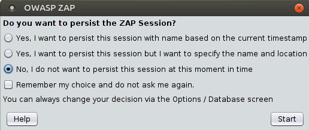
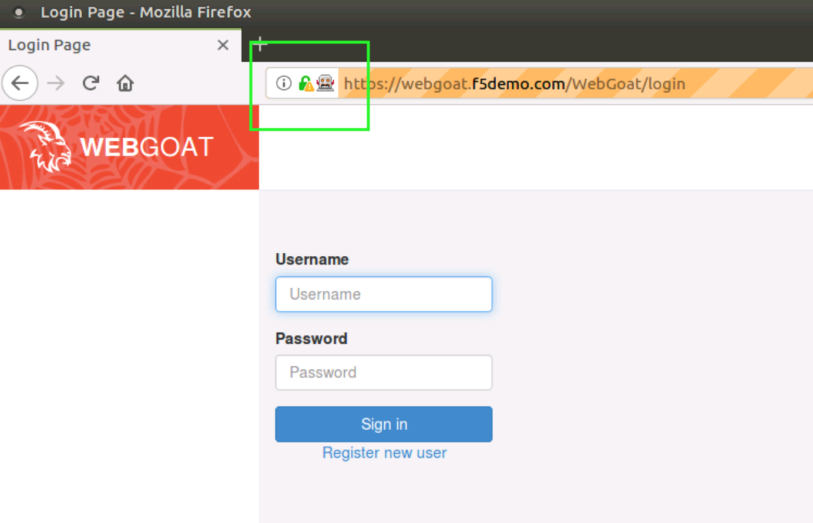
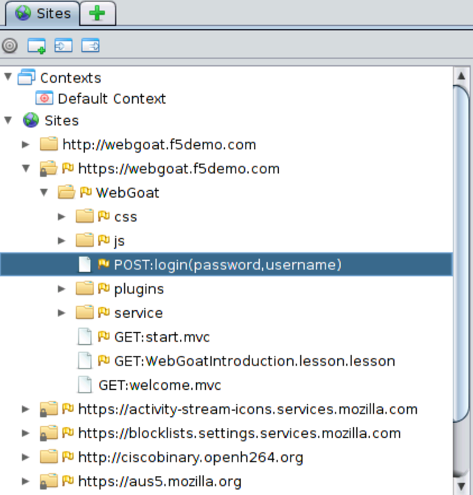
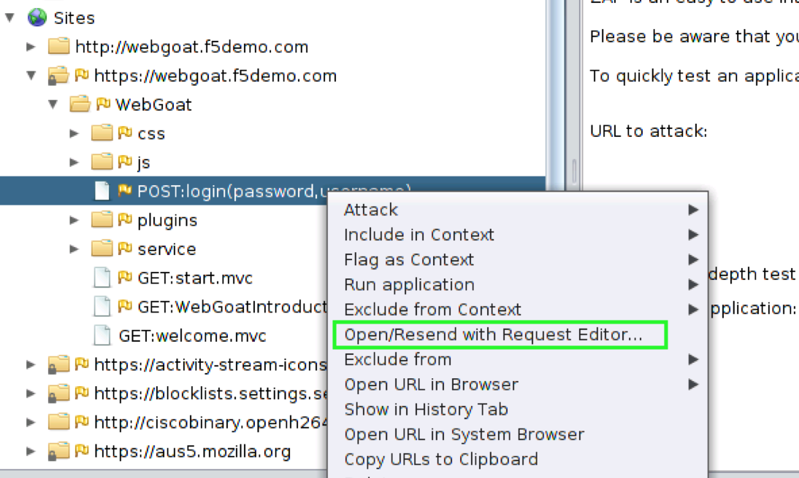
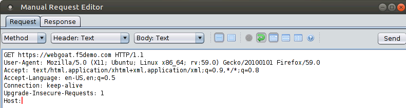
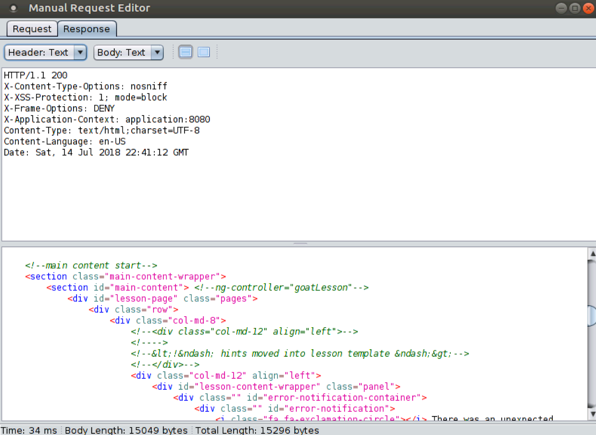
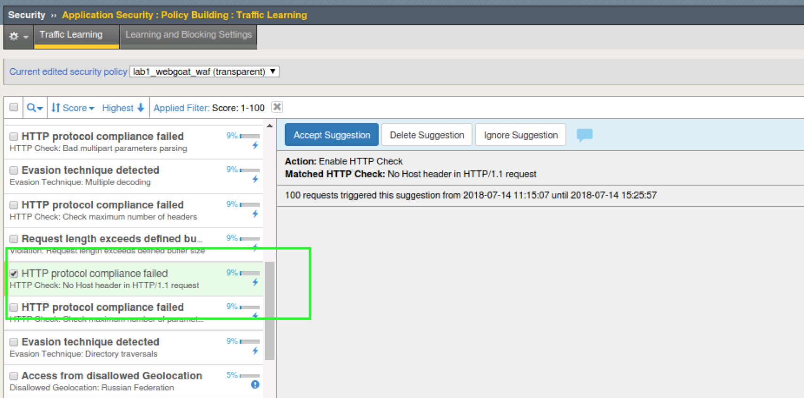

Exercise 2.1: Protocol Compliance
----------------------------------------

Objective
~~~~~~~~~

- Attach the security policy to the appropriate virtual server.

- Validate that the security policy is working correctly.

- Estimated time for completion **10** **minutes**.

Apply Security Policy
~~~~~~~~~~~~~~~~~~~~~

.. IMPORTANT:: To clearly demonstrate just the protocol compliance protection, on the ``webgoat.f5demo.com_https_vs`` virtual server

1. **Remove** the previously created DoS profile and bot logging profile.
2. **Enable** the ``lab1_webgoat_waf`` Security Policy

Your virtual should look like this

.. image:: images/image1.PNG

#. Browse to **Applications > Other > OWASP ZAP** from the Linux OS desktop tool bar or click the springboard icon in the quick launch bar at the top of the screen.

.. NOTE:: This normally takes 30s or more to launch. Do not keep clicking the icon. It's Java....it's slow.

#. Upon initialization, OWASP ZAP will ask if you would like to require session persistence. Select the ``No, I do not want to persist this session at this moment in time.`` option then click **Start**.

3. Launch the **Firefox** browser from within ZAP using the using the **Launch Browser** button while **Firefox** is selected.

.. image:: images/image2_1_2.PNG

4. Browse to and login to the webgoat application. ``https://webgoat.f5demo.com/WebGoat/login`` Click around a little bit.

5. Return to the OWASP ZAP tool. Locate the ``https://webgoat.f5demo.com`` entry under **Sites**.

.. image:: images/image2_1_3.PNG

6. Expand the site ``https://webgoat.f5demo.com`` and find the POST action

7. Rick click that and select the **Open/Resend with Request Editor** option from the flyout window.

8. Select the **Request** tab in the **Manual Request Editor** window.

9. Modify the **Host** header to have no value by removing the ``webgoat.f5demo.com`` value. Press the **Send** button. Repeat a few times.

10. Observe the server response using the **Response** tab of the **Manual Request Editor**. This request is not getting blocked. Why?

Leaning and Blocking
~~~~~~~~~~~~~~~~~~~~~~
The first place we will take a look for why we are not getting blocked is under learning and blocking setting.

1. Navigate to **Security > Application Security > Policy Building > Learning and Blocking Settings** and look for **HTTP Protocol Compliance failed**

2. Notice the violation is set to learn only and is not enabled by default in a policy. That is why the request was not blocked.

3. This means that there must be a learning suggestion ready for us. Let's go take a look.

Now navigate to **Security > Application Security > Policy Building > Traffic Learning** and take a minute to absorb what you're looking at.
These are all the things that ASM has currently learned about your application and are most likely all false positives at this point since this is a controlled environment. Take a look at some of them and look at the suggested actions ASM would like you to implement. If this policy was in automatic mode, when the learning score reaches 100%, the action is automatically taken.

.. IMPORTANT:: Now that you have seen how ASM learns things think about how important it is that ASM get's good clean traffic during policy development and should be part of SDLC of the application.

4. You want to specifically find the learning suggestion for **HTTP protocol compliance failed - HTTP Check: No Host header in HTTP/1.1 request**

5. Note the action ASM is suggesting that you take - **Enable HTTP Check**

6. Click Accept

11. Browse to **Security > Event Logs > Application > Requests** on the BIG-IP GUI. Clear the **Illegal Request** option to view all request received by the security policy.

11. Observe the Illegal requests observed by the security policy. What protocol compliance violations were observed by the security policy?
