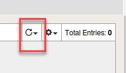

Exercise 3.2: Protection from common exploit vectors
----------------------------------------

Overview
~~~~~~~~~~~~~~~~~~~~~~~~~~~~~~~~~~~~~~~~~~~~~~~~~~~~~

In this exercise you will attack the vulnerable application.  Then apply the blocking policy and observe the results.

~~~~~~~~~~~~~~~~~~~~~~~~~~~~~~~~~~~~~~~~~~~~~~~~~~~~~

Task 1 - Exploring an attack
~~~~~~~~~~~~~~~~~~~~~~~~~~~~~~~~~~~~~~~~~~~~~~~~~~~~~

1.  Within Chrome click on the three dots in the upper right and choose New Incognito window

.. image:: images/image4_3_2.png

2.  Click on the Login Page bookmark to get to the WebGoat application

3.  At the username prompt try entering a sequel query for the username and the letter a for the password

::

    or 1='1

.. NOTE:: Did you see anything?  Why do you think you were not blocked?

4.  Return to the BIG-IP Go to **Security > Event Logs > Application > Requests** and clear the illegal filter.

5.  You will find an entry there for the login page.
.. image:: images/image1.PNG

6.  Return to the WebGoat application and login with credentials f5student and f5DEMOs4u!

7.  From the left menu go to Injection Flaws --> SQL Injection and select exercise 7

.. image:: images/image5_3_2.png

8.  In the account name field try an injection attack

::

    %' or 1='1

9.  You will be able to see a wealth of information

.. image:: images/image6_3_2.png

10. Return to the BIG-IP Go to **Security > Event Logs > Application > Requests**, clear the illegal filter and review the alert.

.. image:: images/image2.PNG

11.  Go to Security --> Application Security --> Policy Building --> Learning and Blocking settings

12.  Click on the carrot next to Attack Signatures and click on the Block check box at the top (this will turn on blocking for all the signatures).  Make sure to click Save and Apply Policy

.. image:: images/image7_3_2.png

.. NOTE::  Now you have enabled blocking for just the signatures.  Note that all other functions are still in only alarm and learn mode.  What attacks do you think will be blocked at this point?  

12.  On the left menu of the BIG-IP right click on Security and select "Open Link in a new Tab"

13.  Go to the new tab.  Select Security --> Event Logs --> Application --> Requests

14.  Open a New Incognito Window in Chrome

15.  Click the bookmark for Login page

16.  At the username prompt try entering a sequel query for the username and the letter a for the password

::

    or 1='1

.. NOTE:: You should see that you are blocked and received a message with a support ID.
.. image:: images/image8_3_2.png

17.  Repeat steps 16-18

.. NOTE:: Did the query work?  Why not?

18.  Return to the BIG-IP and the Event Logs tab

19.  In the upper right corner change the auto refresh to 10 seconds

20.  Click on the log entry for ``/webgoat/login`` and examine the request.

21.  Change from Basic to All Details and will see more details regarding the request

.. image:: images/image10_3_2.png

22.  Click on Attack signature detected

.. image:: images/image11_3_2.png

Task 2 - Using ZAP Proxy
~~~~~~~~~~~~~~~~~~~~~~~~~~~~~~~~~~~~~~~~~~~~~~~~~~~~~

1.  Open ZAP Proxy by locating the icon on the top bar |zap_proxy|

2.  Select No, I do not want to persist this session at this moment in time

3.  Enter the following URL in to the URL to Attack field:
::

    http://webgoat.f5demo.com/WebGoat

In the upper left corner change the mode to Attack mode and then execute the attack

.. image:: images/image12_3_2.png

4.  Return to the BIG-IP and examine the Event Logs.  You will need to stop the auto refresh by clicking on the countdown

.. image:: images/image13_3_2.png

5.  Take a look at the various attacks conducted by ZAP.  Examine the log entries and what signature prevented the attack from occurring.  You can explore the documentation on the signature as well.

.. |zap_proxy| image:: images/zap_proxy.png

What additional functions can you turn on to prevent some of the other attacks?  How would you turn these on?

.. Bonus::

Go to Security --> Application Security --> Policy Building --> Traffic learning

Explore the Learning suggestions and Traffic Summary page.

Locate the Enforcement Readiness section.

.. image:: images/image14_3_2.png

Click on the numbers.  This will take you to the learning and blocking settings page.  This shows you the settings that could be turned on to better protect your application.

To the left you will find a number of learning suggestions.  As traffic traverses your application these learning suggestions will eventually reach higher percentages.

Click on a learning suggestion to explore.  You will learn how many events have been triggered and give you the option to accept the suggestion, delete the suggestion or ignore.

.. NOTE:: The higher the percentage on the learning score the higher the chance you should accept this suggestion.
