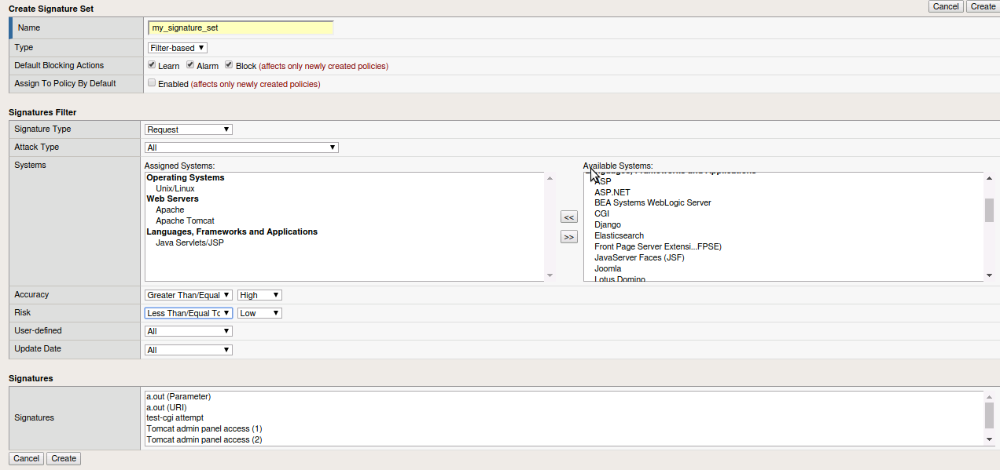
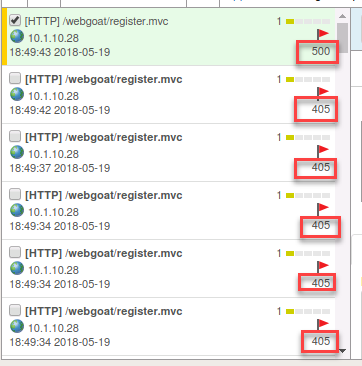

Exercise 3.3: Troubleshooting
----------------------------------------

Objective
~~~~~~~~~~~~~~~~~~~~~~~~~~~~~~~~~~~~~~~~~~~~~~~~~~~~~

In this exercise we will examine the response pages, event logs and briefly look at utilizing HTTP capture tools

Task 2 - Response Pages
~~~~~~~~~~~~~~~~~~~~~~~~~~~~~~~~~~~~~~~~~~~~~~~~~~~~~

1.  Go to **Security > Application Security > Policy > Response pages**

.. image:: images/image1_3_3.png

2.  Within this area you can add various response pages for different request.  These pages can be modified by editing the response body. On the Default change the Response Type to "Custom Response".  This will open up the Response Body to editing.

.. image:: images/image2_3_3.png

3.  Edit the Response as follows:

::

    <html><head><title>Request Rejected</title></head><body>You have requested a site that is unavailable. Please contact customer service at 888-555-1212 and supply the following information:  Support ID: <%TS.request.ID()%>  <a href='javascript:history.back();'>[Go Back]</a></body></html>

4.  Click on the Show button

.. image:: images/image3_3_3.png

5.  Click Save and Apply Policy.  And click OK.

.. NOTE:: Explore the other response pages.  Observe that AJAX reponse pages are disabled by default.

6.  Open a New Incognito Window in Chrome and navigate to the Webgoat login page

7.  Try entering a sql injection.

::

    or 1='1

You should receive the new custom reponse page with your companies support number.  Make note of the Support ID before moving on to the next task.

.. image:: images/image4_3_3.png

.. BONUS:: If you were to login to the web application again and try the SQL Injection do you think you will see a response page?  What can you do to show a response?

Task 3 - Event logs
~~~~~~~~~~~~~~~~~~~~~~~~~~~~~~~~~~~~~~~~~~~~~~~~~~~~~

1.  On the BIG-IP return to the Security --> Event Log --> Application --> requests

2.  Click on the magnifying glass and that will open the log filter.  From here you can enter the Support ID you received from the preceeding task and select Apply Filter.

.. image:: images/image8_3_3.png

2.  Select an entry in the event logs.  At the top box you will find button to open the request in a separate tab

.. image:: images/image5_3_3.png

3.  Click on Attack signature detected

Observe the detected attack, the expected parameter, and what the applied blocking settings were.  Also note that the signature used to block this attack has been identified.  By clicking on the "i" next to the name you can get further information on the signature as well as a link to other documentation.

.. image:: images/image7_3_3.png

4.  Examine the HTTP Header information.  Do you see your attack within the header?

.. image:: images/image9_3_3.png

5.  Observe the Source IP, Accept Status and Support ID.

.. image:: images/image10_3_3.png

6.  Close this tab and return to the BIG-IP Event Logs.  Open the filter again and click on Not Blocked.  Apply Filter

.. image:: images/image11_3_3.png

7.  Locate an entry with a 500 or 405 response code

8.  Pop it out in to a new tab.  Why was this illegal action not blocked?  What was the attack type?  What was the violation rating?
