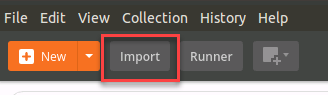

Excercise 4.1:  iControl and Postman
----------------------------------------

Task 1 - Exploring iControl
~~~~~~~~~~~~~~~~~~~~~~~~~~~~~~~~~~~~~~~~~~~~~~~~~~~~~

The iControl REST API available via TMOS can be directly accessed and endpoints explored.

1. Open Google Chrome and navigate to the following bookmarks: BIG-IP A GUI and BIG-IP API ToC.  Accept any SSL warnings/errors that appear and ensure that you can access both login prompts.

2. Click on the **BIG-IP API ToC** bookmark to access the API Table of Contents for BIG-IP A.  The ``/mgmt/toc`` path in the URL is available on all TMOS versions 11.6 or newer.

3. Authenticate using the default **admin/f5DEMOs4u!** credentials.

4. After successfully authenticating, you will be presented with a top-level list of REST resources available on the BIG-IP.  At the top of the page is a search box that can be used to search for specific REST resources.

Task 2 - Postman
~~~~~~~~~~~~~~~~~~~~~~~~~~~~~~~~~~~~~~~~~~~~~~~~~~~~~

We will be using Postman collections to run API calls against our BIG-IP.  Postman is an API development tool we use to create and test out API calls.

1.  For this lab you can find the postman collection located here:

::

  https://github.com/f5devcentral/f5-automation-labs/tree/develop/postman_collections

2.  To import a Postman collection open the Postman client

3.  Click on Import

4.  Choose Import from Link and enter the URL

::

  https://raw.githubusercontent.com/f5devcentral/f5-automation-labs/develop/postman_collections/F5_SecDevOps.postman_environment.json

.. image:: images/import_string.png

5.  You will also need to import the environment file by repeating the above step and in the URL field enter the URL below

::

  https://raw.githubusercontent.com/f5devcentral/f5-automation-labs/develop/postman_collections/F5_SecDevOps.postman_environment.json

6.  Once complete you will see the SecDevOps Postman collection loaded in the left pane

.. image:: images/secdevops.png
