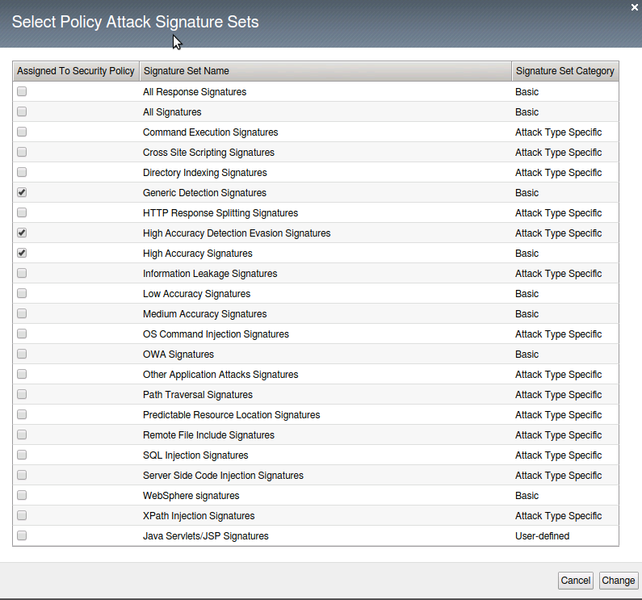

Exercise 3.1: Blocking Policy
----------------------------------------

Objective
~~~~~~~~~~~~~~~~~~~~~~~~~~~~~~~~~~~~~~~~~~~~~~~~~~~~~

You will explore the blocking policy and settings.  The blocking policy used for this lab will focus on negative security using signatures.

Task 1 - Exploring policy
~~~~~~~~~~~~~~~~~~~~~~~~~~~~~~~~~~~~~~~~~~~~~~~~~~~~~
1.  Within the BIG IP go to Security --> Application Security --> Policy Building --> Learning and Blocking Settings

2.  Click on Blocking Settings...

.. image:: images/image1_3_1.png

3.  All the blocking and learning checkboxes are unchecked.  Alarming is still turned on for some critical functions. Close the window.

.. image:: images/image2_3_1.png

4.  Under Policy Building Settings click on the carrot next to Attack Signatures to expand the Attack Signatures options

.. image:: images/image3_3_1.png

5.  Click on the Change button at the far right to bring up the Select Policy Attack Signature sets and choose to add SQL Injection Signatures then click Change

.. image:: images/image9_3_1.png

.. NOTE:: For this lab Signature Staging has been disbaled.  In a production environment you should consider using staging to allow yourself mitigation time before new signatures are implemented.

6.  Ensure that the blocking checkbox has been unchecked for all signatures.  You will click Save and Apply Policy at this point.

.. image:: images/images11_3_1.png

.. NOTE:: You will see an that the policy will apply with errors.  This is because the Policy is set to blocking but we do not have any settings currently in blocking since we unchecked the blocking options.  We will add signatures in to blocking in a later task.

.. image:: images/image12_3_1.png

Task 2 - Tuning policy
~~~~~~~~~~~~~~~~~~~~~~~~~~~~~~~~~~~~~~~~~~~~~~~~~~~~~
1.  Under the General Settings you will see various settings for Enforcement, Learning Mode and Learning Speed.  For this lab the policy has been set in to Blocking with Manual Learning and a learning speed of fast.

.. image:: images/image4_3_1.png

.. NOTE:: Depending on the setting you choose for Learning Mode you may find additional options
.. image:: images/image5_3_1.png

2.  Under Policy Building Process you will find there are settings for Loosen Policy and Tighten Policy.

Loosen Policy would be used when there have been changes to the application.  Policy Builder will identify legitmate traffic based on repeated behavior from a sufficient number of sources that you set.
Tighten Policy only applies when you are using automatic learning.  The policy builder will refine the policy until the number of security policy changes has been reached.
Track Site Changes again only applies to automatic learning.  If enabled this setting allows Policy Builder to discover changes to a web applicaiton.  Policy builder logs the changes and temporarily loosens the policy to make suggestions and adjustments.

.. image:: images/image6_3_1.png

3.  When you have made changes to this page make sure to save the policy and then Apply policy

.. image:: images/image7_3_1.png
.. image:: images/image8_3_1.png
