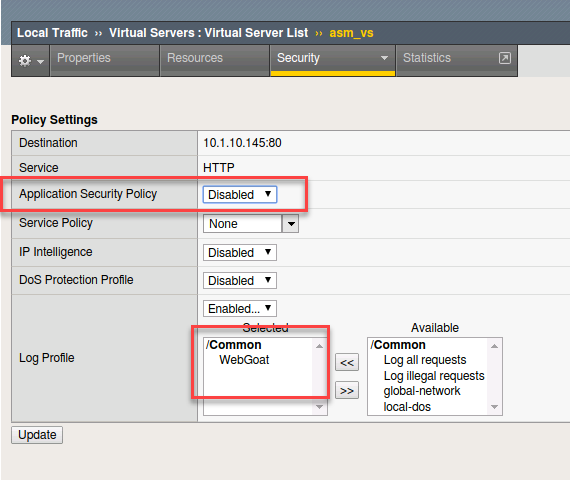
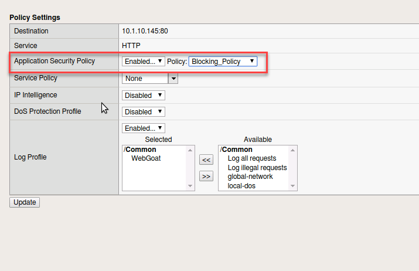
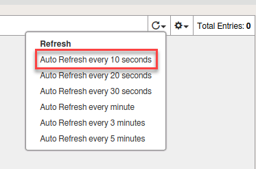

Exercise 3.2: Protection from common exploit vectors
===========================

Overview
-----------------------

In this exercise you will attack the vulnerable application.  Then apply the blocking policy and observe the results.

-----------------------

Task 1 - Exploring an attack
-----------------------

1.  Go to Local Traffic --> Virtual Servers --> Virtual Server List

2.  Click on the asm_vs

.. image:: images/image1_3_2.png

3.  Click on Security and Policies from the top menu

.. image:: images/image2_3_2.png

4.  Make sure to set Application Security Policy to Disabled and that a logging profile has been set

5.  Within Chrome click on the three dots in the upper right and choose New Incognito window

.. image:: images/image4_3_2.png

6.  Click on the Login Page bookmark to get to the WebGoat application

7.  At the username prompt try entering a sequel query for the username and the letter a for the password

::

    %' or 1='1

.. NOTE:: Did you see anything?  Why do you think you were not blocked?

8.  Login with the credentials webgoat and f5DEMOs4u!

9.  Click on Injection Flaws from the left menu and then on SQL Injection

10.  Within the Account Name field try the injection attack again
::

    %' or 1='1

.. image:: images/image5_3_2.png

.. NOTE:: You will see that you are able to access the database and gather a wealth of useful information

.. image:: images/image6_3_2.png

11.  Return to the BIG IP and access the Virtual Server asm_vs.  Click on Security/Policies

12.  Within the Application Security Policy section choose Enabled and Blocking_Policy from the drop down menus.  Then click update

13.  On the left menu of the BIG IP right click on Security and select "Open Link in a new Tab"

14.  Go to the new tab.  Select Event Logs --> Application --> Requests

15.  Open a New Incognito Window in Chrome

16.  Click the bookmark for Login page

17.  At the username prompt try entering a sequel query for the username and the letter a for the password

::

    %' or 1='1

.. NOTE:: You should see that you are blocked and received a message with a support ID.
.. image:: images/image8_3_2.png

18.  Use the back button and repeat steps 8-10

.. NOTE:: Did the query work?  Why not?

19.  Return to the BIG IP and the Event Logs tab

20.  In the upper right corner change the auto refresh to 10 seconds

21.  Click on the log entry for /webgoat/login and examine the request.

22.  Change from Basic to All Details and will see more details regarding the request

.. image:: images/image10_3_2.png

23.  Click on Attack signature detected

.. image:: images/image11_3_2.png

Task 2 - Using ZAP Proxy
-----------------------

1.  Open ZAP Proxy by locating the icon on the top bar |zap_proxy|

2.  Select No, I do not want to persist this session at this moment in time

3.  Enter the following URL in to the URL to Attack field:
::

    http://10.1.10.145/WebGoat

In the upper left corner change the mode to Attack mode and then execute the attack

.. image:: images/image12_3_2.png

4.  Return to the BIG IP and examine the Event Logs.  You will need to stop the auto refresh by clicking on the countdown

.. image:: images/image13_3_2.png

.. |zap_proxy| image:: images/zap_proxy.png
